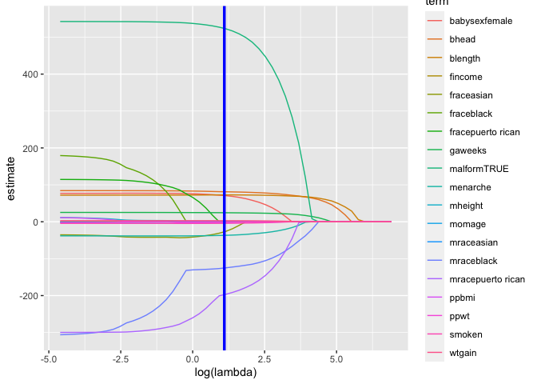

Statistical Learning
================

## Lasso

Predicting birthweight

``` r
bwt_df = 
  read_csv("./data/birthweight.csv") %>% 
  janitor::clean_names() %>%
  mutate(
    babysex = as.factor(babysex),
    babysex = fct_recode(babysex, "male" = "1", "female" = "2"),
    frace = as.factor(frace),
    frace = fct_recode(frace, "white" = "1", "black" = "2", "asian" = "3", 
                       "puerto rican" = "4", "other" = "8"),
    malform = as.logical(malform),
    mrace = as.factor(mrace),
    mrace = fct_recode(mrace, "white" = "1", "black" = "2", "asian" = "3", 
                       "puerto rican" = "4")) %>% 
  sample_n(200)
```

    ## Rows: 4342 Columns: 20

    ## ── Column specification ────────────────────────────────────────────────────────
    ## Delimiter: ","
    ## dbl (20): babysex, bhead, blength, bwt, delwt, fincome, frace, gaweeks, malf...

    ## 
    ## ℹ Use `spec()` to retrieve the full column specification for this data.
    ## ℹ Specify the column types or set `show_col_types = FALSE` to quiet this message.

## let’s do lasso

Let’s fit lasso

``` r
lambda_grid = 10 ^ seq(3, -2, by = -0.1)

lasso_fit = glmnet(x, y, lambda = lambda_grid)

lasso_fit
```

    ## 
    ## Call:  glmnet(x = x, y = y, lambda = lambda_grid) 
    ## 
    ##    Df  %Dev  Lambda
    ## 1   0  0.00 1000.00
    ## 2   0  0.00  794.30
    ## 3   0  0.00  631.00
    ## 4   0  0.00  501.20
    ## 5   0  0.00  398.10
    ## 6   1  4.52  316.20
    ## 7   1 20.47  251.20
    ## 8   2 32.84  199.50
    ## 9   2 40.67  158.50
    ## 10  2 45.61  125.90
    ## 11  3 49.71  100.00
    ## 12  3 52.33   79.43
    ## 13  5 54.46   63.10
    ## 14  6 56.37   50.12
    ## 15  8 58.14   39.81
    ## 16  9 59.60   31.62
    ## 17 11 60.89   25.12
    ## 18 11 61.77   19.95
    ## 19 11 62.32   15.85
    ## 20 11 62.67   12.59
    ## 21 11 62.89   10.00
    ## 22 11 63.03    7.94
    ## 23 12 63.13    6.31
    ## 24 14 63.20    5.01
    ## 25 14 63.25    3.98
    ## 26 15 63.28    3.16
    ## 27 16 63.30    2.51
    ## 28 16 63.33    2.00
    ## 29 16 63.35    1.58
    ## 30 16 63.36    1.26
    ## 31 16 63.37    1.00
    ## 32 18 63.37    0.79
    ## 33 19 63.40    0.63
    ## 34 19 63.42    0.50
    ## 35 18 63.43    0.40
    ## 36 18 63.44    0.32
    ## 37 18 63.44    0.25
    ## 38 18 63.44    0.20
    ## 39 19 63.45    0.16
    ## 40 19 63.45    0.13
    ## 41 19 63.45    0.10
    ## 42 19 63.45    0.08
    ## 43 19 63.45    0.06
    ## 44 19 63.46    0.05
    ## 45 19 63.46    0.04
    ## 46 19 63.46    0.03
    ## 47 19 63.46    0.03
    ## 48 19 63.46    0.02
    ## 49 19 63.46    0.02
    ## 50 19 63.46    0.01
    ## 51 19 63.46    0.01

``` r
## cv
lasso_cv = cv.glmnet(x, y, lambda = lambda_grid)
lasso_opt = lasso_cv$lambda.min
```

See what we actually did

``` r
lasso_fit %>%
  broom::tidy() %>%
  complete(term, lambda, fill = list(estimate = 0)) %>%
  filter(term != '(Intercept)') %>%
  ggplot(aes(x = log(lambda), y = estimate, group = term, color = term)) + 
  geom_path() + 
  geom_vline(xintercept = log(lasso_opt, 10), color = "blue", size = 1.2) #+
```

<!-- -->

``` r
  #theme(legend.position = "none")
```

## Cluster pokemon

``` r
polemon_df = 
  read_csv("data/pokemon.csv") %>%
  janitor::clean_names() %>%
  select(speed, hp)
```

    ## Rows: 800 Columns: 13

    ## ── Column specification ────────────────────────────────────────────────────────
    ## Delimiter: ","
    ## chr (3): Name, Type 1, Type 2
    ## dbl (9): #, Total, HP, Attack, Defense, Sp. Atk, Sp. Def, Speed, Generation
    ## lgl (1): Legendary

    ## 
    ## ℹ Use `spec()` to retrieve the full column specification for this data.
    ## ℹ Specify the column types or set `show_col_types = FALSE` to quiet this message.

Take a quick look at our pokemon
